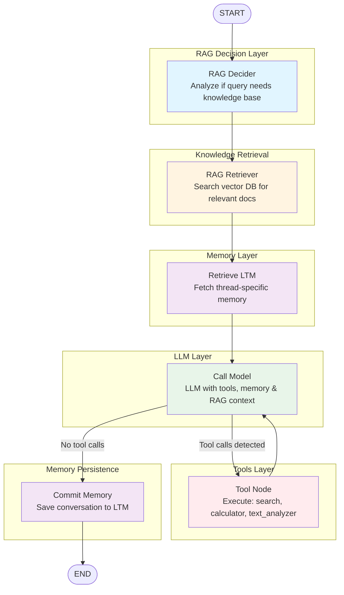

# Advanced RAG Agent - LangGraph Architecture

## Mermaid Diagram



## Node Descriptions

| Node | Function | Purpose |
|------|----------|---------|
| **rag_decider** | `rag_decider()` | Analyzes user message to determine if RAG (Retrieval-Augmented Generation) should be used based on topic relevance |
| **rag_retriever** | `rag_retriever()` | Retrieves relevant documents from the vector knowledge base if RAG is enabled |
| **retrieve** | `retrieve_ltm()` | Fetches relevant context from the thread's long-term memory (ChromaDB) |
| **model** | `call_model()` | Invokes the LLM with system prompt, memory context, RAG context, and tool bindings |
| **tools** | `ToolNode(tools)` | Executes tool calls (DuckDuckGo search, calculator, text analyzer) when requested by LLM |
| **commit_memory** | `save_to_ltm()` | Saves the conversation exchange to the thread's long-term memory for future retrieval |

## Decision Points

### 1. RAG Decision (rag_decider)
- **Condition**: Analyzes if the user's query involves technical AI/ML concepts that would benefit from knowledge base retrieval
- **Action**: Sets `use_rag` flag in state
- **Logic**: LLM-based classification of query relevance to NLP, GANs, Transformers topics

### 2. Tool Usage Decision (model → tools_condition)
- **Condition**: Checks if the LLM response contains tool calls
- **Paths**:
  - **Tool calls detected** → Route to `tools` node for execution
  - **No tool calls** → Route directly to `commit_memory` node
- **Logic**: Uses LangGraph's built-in `tools_condition` function

## Flow Summary

1. **START** → User message enters the graph
2. **RAG Decider** → Determines if knowledge base search is needed
3. **RAG Retriever** → Fetches relevant documents if RAG enabled
4. **Retrieve LTM** → Fetches thread-specific memory context
5. **Call Model** → LLM generates response with all available context
6. **Decision Point** → 
   - If tools needed → Execute tools → Loop back to model
   - If no tools → Save to memory → END
7. **Commit Memory** → Perserves conversation for future interactions
8. **END** → Response returned to user

## State Schema (AgentState)

```python
class AgentState(TypedDict):
    messages: Annotated[list[BaseMessage], add_messages]  # Conversation history
    context: str                                          # Long-term memory context
    use_rag: bool                                         # RAG flag
    rag_ctx: list[str]                                    # Retrieved documents
    thread_id: str                                        # Thread identifier for memory isolation
```
