# Visual Search System — ML System Design

> Based on: ByteByteGo — Machine Learning System Design Interview: Visual Search System

---

## Table of Contents

1. [Problem Statement](#1-problem-statement)
2. [Requirements & Constraints](#2-requirements--constraints)
3. [Conceptual Overview](#3-conceptual-overview)
4. [High-Level Design (HLD)](#4-high-level-design-hld)
5. [Low-Level Design (LLD)](#5-low-level-design-lld)
6. [ML Model Deep Dive](#6-ml-model-deep-dive)
7. [Data Pipeline](#7-data-pipeline)
8. [Serving & Scalability](#8-serving--scalability)
9. [Evaluation & Metrics](#9-evaluation--metrics)
10. [Failure Modes & Mitigations](#10-failure-modes--mitigations)

---

## 1. Problem Statement

Design a **Visual Search System** — a product feature (à la Pinterest Lens, Google Lens, or Amazon's "Shop the Look") that allows users to:

- Upload or capture an image as a query
- Retrieve visually similar items from a large catalog (potentially billions of items)
- Return ranked results in near real-time (<500 ms P99 latency)

---

## 2. Requirements & Constraints

### Functional Requirements

- Accept image upload or URL as input query
- Return top-K visually similar items from the product catalog
- Support filtering by category, price range, availability
- Allow region-specific personalization

### Non-Functional Requirements

| Dimension | Target |
|---|---|
| Latency (P99) | < 500 ms end-to-end |
| Throughput | 10,000 QPS peak |
| Catalog Size | ~1 billion items |
| Freshness | New items indexed within 1 hour |
| Availability | 99.99% uptime |
| Recall@K | > 90% for top-10 results |

### Out of Scope

- Text-based search
- Video search
- Real-time auction or live pricing

---

## 3. Conceptual Overview

A visual search system fundamentally relies on **representation learning**: converting raw pixels into dense embedding vectors that encode semantic and visual meaning, then finding approximate nearest neighbors in that embedding space.

### Core Concepts

**Embedding Space:** Images are mapped to a high-dimensional vector (e.g., 256-d or 512-d). Similar-looking images land close together in this space. The entire system quality depends on the quality of this learned embedding.

**Approximate Nearest Neighbor (ANN) Search:** Exact nearest-neighbor search over 1 billion vectors is computationally infeasible in real time. ANN algorithms (HNSW, IVF-PQ, ScaNN) trade a small amount of recall for orders-of-magnitude speedup.

**Contrastive Learning:** Modern embedding models are trained using contrastive objectives (e.g., SimCLR, CLIP, TripletLoss) — pulling similar pairs together and pushing dissimilar pairs apart in embedding space.

**Two-Stage Retrieval (Recall → Rank):**
- **Stage 1 — Recall:** Fast ANN search retrieves thousands of candidates.
- **Stage 2 — Rank:** A heavier model re-ranks candidates with richer features (color, texture, metadata, personalization signals).

```
Query Image → Embedding → ANN Retrieval → Re-ranking → Final Results
```

---

## 4. High-Level Design (HLD)

### System Architecture Overview

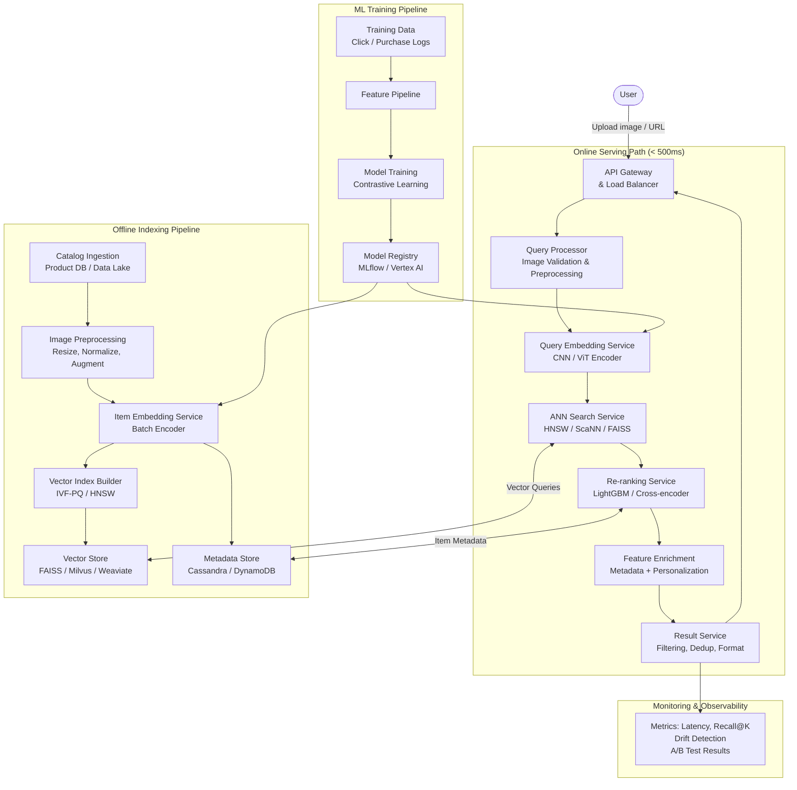

### Key Components

**API Gateway:** Rate limiting, authentication, request routing, edge caching of popular queries.

**Query Processor:** Validates image format/size, decodes, resizes to model input dimensions (e.g., 224×224), normalizes pixel values.

**Query Embedding Service:** Runs the vision encoder (CNN or ViT) to produce a query vector. Horizontally scaled stateless microservice with GPU acceleration.

**ANN Search Service:** Finds top-K approximate nearest neighbors in the vector index. Sub-10ms latency for billion-scale indexes using HNSW or IVF-PQ.

**Re-ranking Service:** Takes top-1000 ANN candidates, re-scores them using richer signals (visual similarity fine-grained score, diversity, personalization, item quality).

**Vector Store:** Distributed vector database storing ~1B embeddings. Sharded across nodes. Supports incremental updates for catalog freshness.

**Metadata Store:** Stores item attributes (category, price, availability, seller rating) used in filtering and re-ranking.

---

## 5. Low-Level Design (LLD)

### 5.1 Query Embedding Service

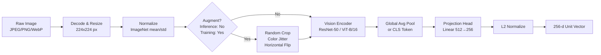

**Design Decisions:**
- **ViT-B/16** preferred over ResNets for CLIP-style training; better semantic representation
- **L2 normalization** ensures cosine similarity == dot product → enables optimized ANN
- **Projection head** reduces embedding dimension, saving storage and ANN search time
- **ONNX + TensorRT** for inference optimization; 2-5× speedup over raw PyTorch

### 5.2 ANN Index Architecture

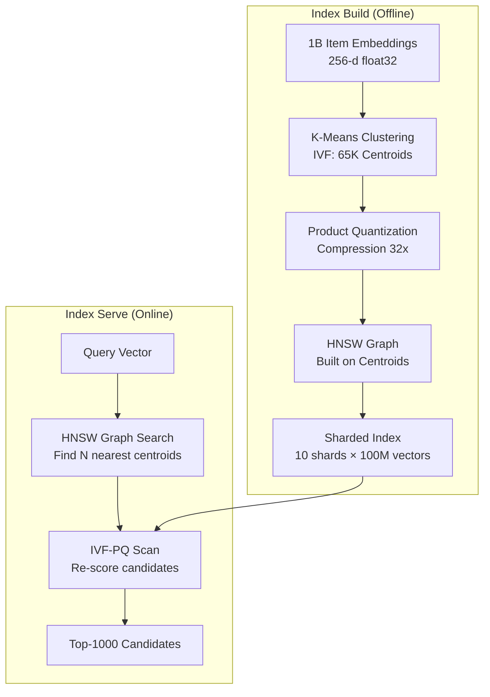

**ANN Algorithm Comparison:**

| Algorithm | Recall@10 | Latency | Memory | Build Time |
|---|---|---|---|---|
| Exact (brute force) | 100% | ~10s | High | N/A |
| HNSW | ~99% | ~5ms | High | Medium |
| IVF-PQ | ~95% | ~3ms | Low | Low |
| ScaNN | ~97% | ~2ms | Medium | Medium |
| **Chosen: HNSW+PQ** | ~97% | ~4ms | Medium | Medium |

### 5.3 Re-ranking Service

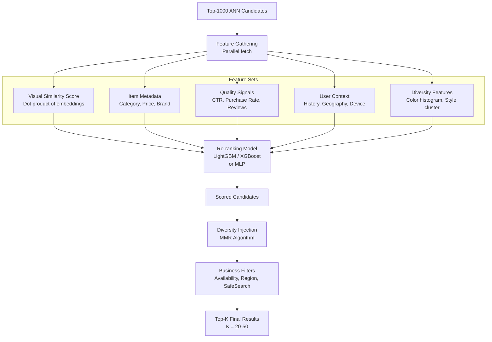

### 5.4 Offline Index Update Flow

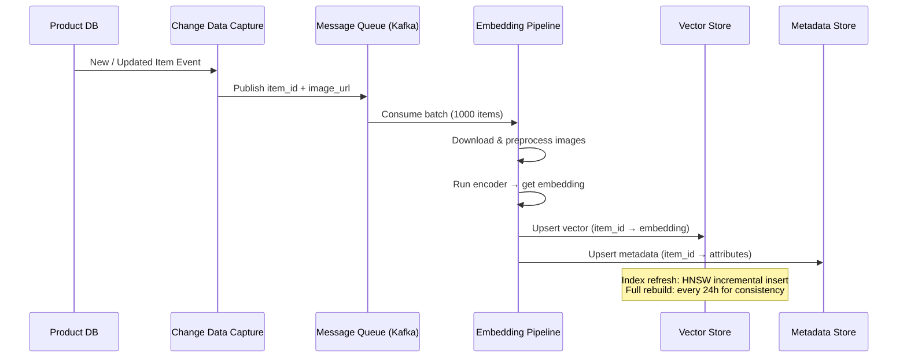

### 5.5 Training Pipeline

```mermaid
flowchart TD
    subgraph Data_Collection["Data Collection"]
        CLICK[Click Logs] --> POS[Positive Pairs\nClicked item after visual search]
        CART[Cart / Purchase Logs] --> HPOS[Hard Positives\nPurchased after visual search]
        NOCLK[No-click Impressions] --> NEG[Negative Pairs]
    end

    subgraph Contrastive_Training["Contrastive Training"]
        POS --> SAMPLER[Hard Negative Mining\nOnline / Offline]
        HPOS --> SAMPLER
        NEG --> SAMPLER
        SAMPLER --> TRIPLET[Triplet Construction\nAnchor, Positive, Negative]
        TRIPLET --> ENC1[Encoder Branch 1\nShared Weights]
        TRIPLET --> ENC2[Encoder Branch 2\nShared Weights]
        ENC1 --> LOSS[Contrastive Loss\nInfoNCE / NT-Xent / Triplet]
        ENC2 --> LOSS
        LOSS --> BACK[Backpropagation\nAdam, LR=1e-4]
    end

    subgraph Eval["Offline Evaluation"]
        BACK --> CKPT[Checkpoint]
        CKPT --> REC[Recall@K on\nHeld-out Query Set]
        REC --> REG[Model Registry\nif Recall improves]
        REG --> SHADOW[Shadow Deployment\nShadow Traffic Test]
        SHADOW --> ABTST[A/B Test\nOnline Metrics]
    end

    Data_Collection --> Contrastive_Training
    Contrastive_Training --> Eval
```

---

## 6. ML Model Deep Dive

### 6.1 Model Architecture

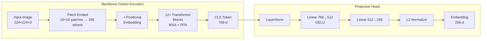

**Model Choices:**

| Model | Params | Recall@10 | Latency (GPU) | Notes |
|---|---|---|---|---|
| ResNet-50 | 25M | 88% | 8ms | Baseline; fast to train |
| EfficientNet-B4 | 19M | 91% | 10ms | Good accuracy/size tradeoff |
| ViT-B/16 | 86M | 94% | 15ms | Best quality; CLIP-pretrained |
| ViT-L/14 (CLIP) | 307M | 97% | 40ms | Too slow for online serving |
| **ViT-B/16 (fine-tuned)** | **86M** | **94%** | **15ms** | **Chosen** |

### 6.2 Loss Function

**InfoNCE (Contrastive) Loss:**

Given a batch of N (query, positive) pairs, the loss is:

```
L = -log [ exp(sim(q, p+) / τ) / Σ exp(sim(q, pj) / τ) ]
```

Where:
- `sim(a, b)` = cosine similarity
- `τ` = temperature (learnable, initialized to 0.07)
- Negatives = all other items in the batch (in-batch negatives) + hard negatives

**Hard Negative Mining:** Items that are visually similar but semantically different (e.g., same color shirt, different brand) push the model to learn finer-grained distinctions.

### 6.3 Training Infrastructure

```mermaid
flowchart LR
    S3["Image Storage\nS3 / GCS"] --> DL[Data Loader\nPetastorm / WebDataset]
    DL --> AUG[Augmentation\nRandAugment]
    AUG --> GPU[8× A100 GPUs\nDDP Training]
    GPU --> CKPT[Checkpoint\nevery epoch]
    CKPT --> VAL[Validation\nRecall@K, MRR]
    VAL -->|Best model| REG[Model Registry\nMLflow]
```

**Training Config:**
- Batch size: 4096 (512 per GPU × 8 GPUs)
- Optimizer: AdamW, LR = 1e-4 with cosine warmup
- Epochs: 50–100 depending on data size
- Mixed precision: FP16 for speed, FP32 for loss
- Time to train: ~48 hours on 8× A100

---

## 7. Data Pipeline

### 7.1 Training Data Construction

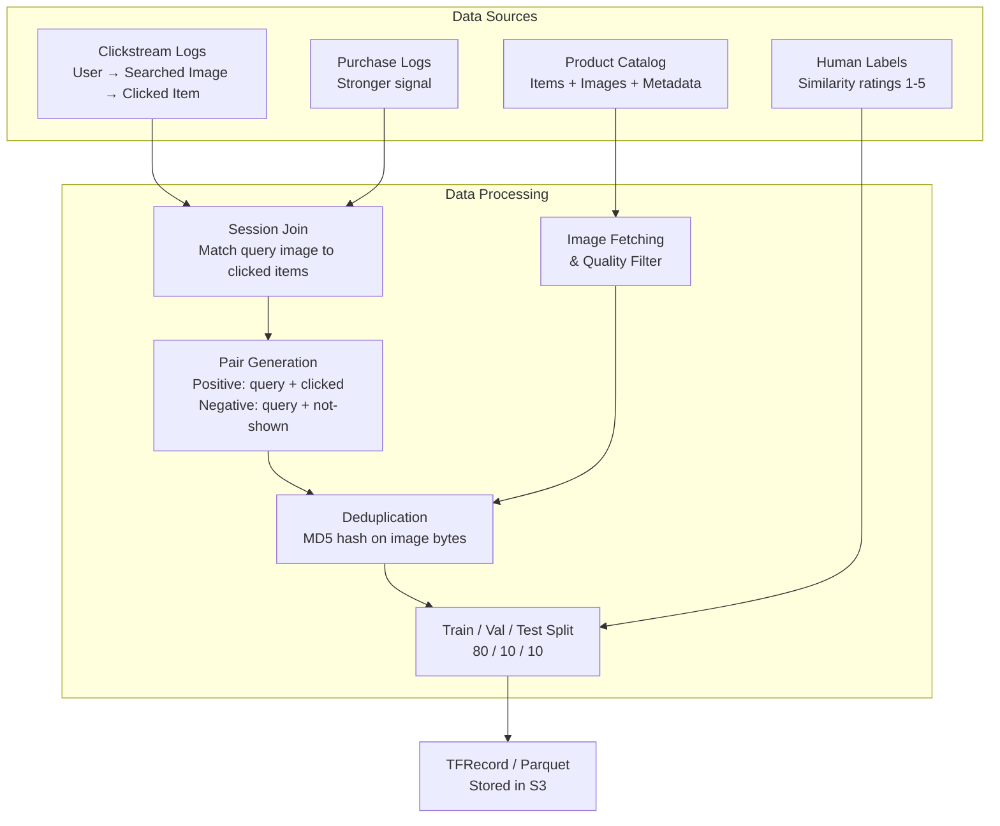

### 7.2 Data Quality Checks

| Check | Method | Action on Fail |
|---|---|---|
| Broken image URLs | HTTP probe | Drop sample |
| Low resolution | < 64×64 px | Drop sample |
| Duplicate images | Perceptual hash | Deduplicate |
| NSFW content | Safety classifier | Filter out |
| Label noise | Confidence threshold | Downsample |

---

## 8. Serving & Scalability

### 8.1 Request Flow with Latency Budget

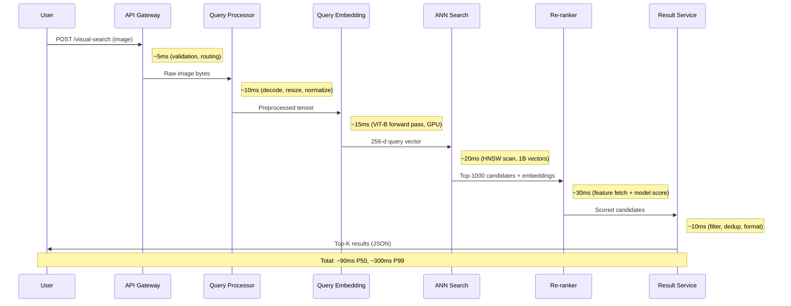

### 8.2 Horizontal Scaling Strategy

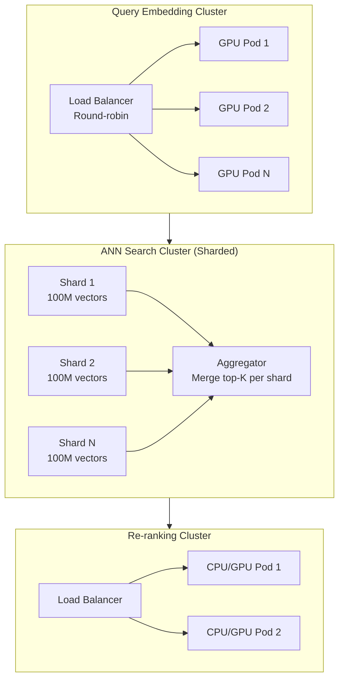

**Sharding Strategy for Vector Index:**
- Shard by `item_id % N` (random sharding for balanced load)
- Each shard: 100M vectors × 256-d × 4 bytes ≈ 100 GB memory
- 10 shards = 1B vectors, ~1 TB total RAM across cluster

### 8.3 Caching Strategy

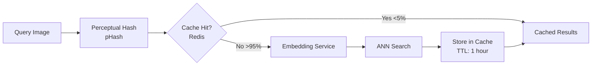

> Note: Image search has low cache hit rate since each query image is unique. Caching is more effective at the result metadata level (product info, thumbnails).

---

## 9. Evaluation & Metrics

### 9.1 Offline Metrics

```mermaid
flowchart TD
    subgraph Retrieval_Quality["Retrieval Quality"]
        R1[Recall@K\nFraction of relevant items in top-K]
        R2[MRR\nMean Reciprocal Rank]
        R3[NDCG@K\nNormalized Discounted Cumulative Gain]
    end

    subgraph Embedding_Quality["Embedding Quality"]
        E1[ANN Recall vs Exact\nANN recall @ 95%+]
        E2[Intra-class Similarity\nSame category items cluster together]
        E3[t-SNE Visualization\nVisual inspection of clusters]
    end

    subgraph System_Perf["System Performance"]
        S1[P50 / P95 / P99 Latency]
        S2[QPS Throughput\nUnder sustained load]
        S3[GPU Utilization\n& Memory]
    end

    Embedding_Quality --> Retrieval_Quality
    System_Perf --> Retrieval_Quality
```

**Target Thresholds:**

| Metric | Threshold | Priority |
|---|---|---|
| Recall@10 (offline) | > 90% | Critical |
| MRR | > 0.6 | High |
| P99 Latency | < 500ms | Critical |
| ANN Recall vs Exact | > 95% | High |
| Index Freshness | < 1 hour | Medium |

### 9.2 Online Metrics (A/B Test)

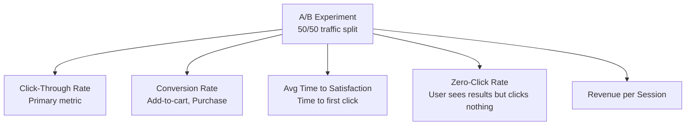

**Guardrail Metrics** (must not degrade):
- Page load time < 2s
- Error rate < 0.1%
- Zero-click rate must not increase significantly

---

## 10. Failure Modes & Mitigations

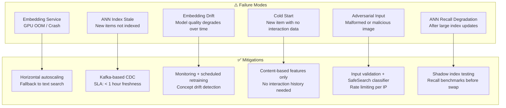

### Summary of Key Design Decisions

| Decision            | Choice                         | Rationale                                                               |
| ---------------------| --------------------------------| -------------------------------------------------------------------------|
| Embedding model     | ViT-B/16 (CLIP fine-tuned)     | Best quality/latency tradeoff; transfer learning from large pretraining |
| Embedding dimension | 256-d                          | Balances ANN recall, storage, and search latency                        |
| ANN algorithm       | HNSW + IVF-PQ                  | HNSW graph for fast traversal; PQ for compression of large catalog      |
| Re-ranking model    | LightGBM                       | Fast CPU inference; supports diverse feature types                      |
| Training objective  | InfoNCE contrastive loss       | State-of-art for representation learning; leverages in-batch negatives  |
| Index sharding      | By item_id mod N               | Even load distribution; simple routing logic                            |
| Freshness strategy  | Kafka CDC + incremental upsert | < 1 hour latency; avoids full index rebuilds                            |
| Caching             | Perceptual hash, Redis, TTL=1h | Low hit rate for query images; better for result metadata               |

---

*End of Document*